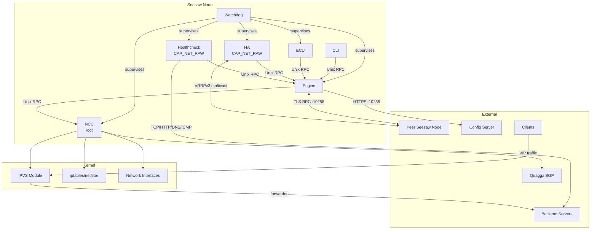

# Seesaw v2 Codebase Architecture

This document describes the internal architecture of Seesaw v2 for developers contributing to or maintaining the project.

## Table of Contents

- [Project Overview](#project-overview)
- [Repository Layout](#repository-layout)
- [Binary Entrypoints](#binary-entrypoints)
- [Architecture Diagram](#architecture-diagram)
- [Core Package Deep Dives](#core-package-deep-dives)
- [Inter-Component Communication](#inter-component-communication)
- [Configuration Pipeline](#configuration-pipeline)
- [Data Flow: Healthcheck to IPVS](#data-flow-healthcheck-to-ipvs)
- [State Hierarchy](#state-hierarchy)

---

## Project Overview

Seesaw v2 is a Linux Virtual Server (LVS) based Layer 4 load balancer. It provides:

- **DSR, NAT, and Tunnel** load balancing modes via the Linux kernel IPVS module
- **High Availability** between two nodes using VRRPv3 (RFC 5798)
- **Anycast VIP** support via BGP (Quagga integration)
- **Centralized configuration** with automatic reload and peer synchronization
- **Health monitoring** with TCP, HTTP, DNS, ICMP, UDP, and RADIUS checks

The system is written in Go and uses C bindings (cgo) for the IPVS netlink interface.

### Build System

- **Go modules** for dependency management (`go.mod`)
- **Makefile** targets: `make test`, `make install`, `make proto`, `make install-test-tools`
- **Protobuf** definitions in `pb/config/config.proto` and `pb/seesaw/seesaw.proto`
- **C dependencies**: libnl-3, libnl-genl-3 (for IPVS netlink operations)

---

## Repository Layout

```
seesaw/
├── binaries/               # Main entrypoints for all 7 executables
│   ├── seesaw_cli/
│   ├── seesaw_ecu/
│   ├── seesaw_engine/
│   ├── seesaw_ha/
│   ├── seesaw_healthcheck/
│   ├── seesaw_ncc/
│   └── seesaw_watchdog/
├── cli/                    # Command-line interface logic
├── common/                 # Shared packages
│   ├── conn/               # Engine connection wrappers
│   ├── ipc/                # IPC contexts and authentication
│   ├── seesaw/             # Shared types, constants, VIP/Host/Backend
│   └── server/             # RPC accept, privilege dropping, signal handling
├── doc/                    # Existing documentation
├── docs/                   # Comprehensive documentation (this directory)
├── ecu/                    # External Control Unit (remote monitoring)
├── engine/                 # Core control plane
│   └── config/             # Configuration loading and notification
├── etc/                    # Example configuration files and init scripts
│   ├── init/
│   ├── seesaw/
│   └── systemd/
├── ha/                     # High Availability (VRRPv3)
├── healthcheck/            # Health monitoring implementations
├── ipvs/                   # Linux IPVS kernel interface (cgo)
├── netlink/                # Netlink socket abstraction (cgo)
├── ncc/                    # Network Control Centre (root-privileged)
│   ├── client/             # NCC RPC client
│   └── types/              # NCC RPC types
├── pb/                     # Protocol buffer definitions
│   ├── config/
│   └── seesaw/
├── quagga/                 # BGP daemon integration
├── test_tools/             # Testing utilities
└── watchdog/               # Service supervisor
```

---

## Binary Entrypoints

Seesaw consists of 7 binaries, each in `binaries/seesaw_*/main.go`.

### seesaw_watchdog

**Source:** `binaries/seesaw_watchdog/main.go`
**Runs as:** `seesaw` user
**Purpose:** Service supervisor that starts and monitors all other Seesaw components.

- Reads `watchdog.cfg` to determine which services to run
- Manages service dependencies (e.g., engine depends on NCC)
- Restarts crashed services with exponential backoff (5s to 60s)
- Dependency-aware shutdown ordering

### seesaw_engine

**Source:** `binaries/seesaw_engine/main.go`
**Runs as:** Starts as root, drops to `seesaw` user
**Purpose:** Central control plane managing all load balancer state.

Startup flow:
1. Parse `seesaw.cfg` configuration file
2. Create Engine with NCC client connection
3. Drop privileges to `seesaw` user via `server.DropPrivileges()`
4. Call `engine.Run()` which initializes network, starts notifier, and enters `manager()` loop

### seesaw_ncc

**Source:** `binaries/seesaw_ncc/main.go`
**Runs as:** root (enforced with `os.Getuid() != 0` check)
**Purpose:** Network Control Centre providing privileged kernel operations.

- Exposes Go RPC over Unix socket (`/var/run/seesaw/ncc`)
- Performs IPVS, iptables, routing, ARP, and sysctl operations
- Only component that requires root privileges at runtime

### seesaw_healthcheck

**Source:** `binaries/seesaw_healthcheck/main.go`
**Runs as:** `seesaw` user with CAP_NET_RAW
**Purpose:** Performs periodic health checks against backends.

- Requires CAP_NET_RAW for ICMP ping checks
- Runs `healthcheck.Server` which manages check scheduling and notification

### seesaw_ha

**Source:** `binaries/seesaw_ha/main.go`
**Runs as:** `seesaw` user with CAP_NET_RAW
**Purpose:** High availability peering between nodes via VRRPv3.

- Requires CAP_NET_RAW for raw IP sockets (protocol 112)
- Monitors engine socket via fsnotify for fast failover detection
- Implements VRRPv3 state machine (BACKUP/LEADER/SHUTDOWN)

### seesaw_ecu

**Source:** `binaries/seesaw_ecu/main.go`
**Runs as:** `seesaw` user
**Purpose:** External Control Unit providing HTTP/HTTPS monitoring and control.

- HTTP monitoring endpoint on port 10257
- HTTPS control endpoint on port 10256 (requires authentication)
- Pluggable authenticator interface for custom SSO integration

### seesaw_cli

**Source:** `binaries/seesaw_cli/main.go`
**Runs as:** Any user (local only)
**Purpose:** Interactive command-line interface for viewing and controlling Seesaw.

- Connects to engine via Unix socket IPC
- Uses trusted context (`ipc.NewTrustedContext`)
- Supports tab completion and command prefix matching

---

## Architecture Diagram



### Key Relationships

- **Watchdog** supervises all other components (except CLI)
- **Engine** is the central hub; all components communicate with it via Unix socket RPC
- **NCC** is the only root-privileged component; engine delegates all kernel operations to it
- **Sync** between master and backup nodes uses mutual TLS over TCP (port 10258)
- **HA** uses raw IP sockets for VRRPv3 advertisements (multicast 224.0.0.18)

---

## Core Package Deep Dives

### engine/ — The Control Plane Core

The engine is the central hub of the system.

**`engine/core.go`** — Engine struct and lifecycle

The `Engine` struct holds all system state:
- `notifier` — config change notifications
- `fwmAlloc` — firewall mark allocator (base 256, size 8000)
- `bgpManager`, `haManager`, `hcManager` — subsystem managers
- `ncc`, `lbInterface` — NCC client for kernel operations
- `syncClient`, `syncServer` — peer state synchronization
- `vservers` — map of active vservers
- `overrides` — manual state overrides

`Run()` startup sequence:
1. `initNetwork()` — flush IPVS, configure LB interface, init anycast
2. `config.NewNotifier()` — bootstrap configuration from peer/disk/server
3. Start goroutines: bgpManager, hcManager, syncClient, syncServer, syncRPC, engineIPC, gratuitousARP
4. Enter `manager()` event loop

`manager()` event loop processes (in priority order):
1. HA state changes (`haManager.stateChan`) — calls `becomeMaster()` or `becomeBackup()`
2. HA status updates (`haManager.statusChan`)
3. Config notifications (`notifier.C`) — triggers `updateVservers()`, `updateVLANs()`, `updateARPMap()`
4. HA timer expiry — sets state to UNKNOWN
5. Vserver snapshots — stores current state for IPC queries
6. Overrides — distributes to affected vservers, syncs to peer
7. Shutdown — orderly teardown

**`engine/vserver.go`** — Vserver state management

The vserver package contains the most complex logic. Each vserver runs its own goroutine:

```
vserver
├── services (map by ServiceKey: IP + port + protocol)
│   └── destinations (map by IP)
│       └── checks (map by healthcheck ID)
└── VIPs (map of active VIP interfaces)
```

Each `vserver.run()` goroutine processes:
- `quit` — stop signal
- `overrideChan` — manual state overrides
- `updateChan` — configuration updates
- `checkChan` — healthcheck results
- `notifyChan` — notification requests
- `statsTicker` — periodic statistics collection

State propagation flows upward:
1. Healthcheck result → `destination.updateState()`
2. destination healthy/unhealthy → `service.updateState()` (checks watermarks)
3. service state → `vserver.updateState()` (configures/unconfigures VIPs)

**`engine/healthcheck.go`** — Healthcheck orchestration

The `healthcheckManager` bridges the engine and healthcheck daemon:
- `buildMaps()` — creates healthcheck configurations from vserver configs
- `dedup()` — deduplicates identical checks across services
- Allocates DSR/TUN marks for healthchecks that need kernel-level routing

**`engine/ha.go`** — HA state machine coordination

The `haManager` tracks HA state and coordinates transitions:
- States: UNKNOWN, LEADER, FOLLOWER, DISABLED
- `becomeMaster()` — disables sync client, sets config source to Server, brings up LB interface
- `becomeBackup()` — enables sync client, brings down LB interface
- Exposes `requestFailover()` for CLI-triggered failover

**`engine/bgp.go`** — BGP neighbor management

The `bgpManager` periodically (every 15s default) queries Quagga for BGP neighbor state and stores it for IPC queries.

**`engine/sync.go`** — Peer synchronization

Two-part design:
- `syncServer` — runs on master, accepts TLS connections from backup, provides long-polling for state updates
- `syncClient` — runs on backup, polls master for updates

Sync note types: Heartbeat, Desync, ConfigUpdate, Healthcheck, Override

**`engine/ipc.go`** — IPC service

The `SeesawEngine` struct exposes all IPC methods for CLI, ECU, HA, and healthcheck:
- `Failover`, `HAConfig`, `HAState`, `HAUpdate`
- `Vservers`, `Backends`, `ConfigStatus`, `ConfigReload`, `ConfigSource`
- `HealthState`, `Healthchecks`
- `OverrideVserver`, `OverrideBackend`, `OverrideDestination`

**`engine/access.go`** — Access control

Per-vserver access control using `access_grant` entries from cluster.pb:
- Maps vserver names to allowed users/groups
- Roles: ADMIN, OPS
- Checked on override and control operations

### engine/config/ — Configuration

**`engine/config/engine.go`** — All configuration defaults

`EngineConfig` struct with defaults:
| Field | Default | Description |
|-------|---------|-------------|
| ConfigInterval | 1 min | Config poll interval |
| ConfigServerPort | 10255 | Config server HTTPS port |
| ConfigServerTimeout | 20s | Per-connection timeout |
| BGPUpdateInterval | 15s | BGP neighbor update interval |
| HAStateTimeout | 30s | HA state change timeout |
| StatsInterval | 15s | Statistics collection interval |
| GratuitousARPInterval | 10s | GARP broadcast interval |
| SyncPort | 10258 | Peer sync TCP port |
| VRID | 60 | VRRP virtual router ID |
| MaxPeerConfigSyncErrors | 3 | Peer failures before fallback |
| RoutingTableID | 2 | Policy routing table |
| UseVMAC | true | Use VRRP MAC address |

**`engine/config/notifier.go`** — Configuration change monitoring

The Notifier watches for configuration changes:

Bootstrap chain (tried in order):
1. Peer (via sync RPC)
2. Disk (`/etc/seesaw/cluster.pb`)
3. Server (HTTPS from config servers)

`configCheck()` runs on timer (ConfigInterval) or on-demand reload:
1. Pull config from current source
2. Compare with last known config
3. If changed, apply rate limiting (max 10 vserver adds/deletes per cycle)
4. Send notification to engine
5. Save to disk as backup

**`engine/config/fetcher.go`** — Config server client

Fetches cluster.pb from configured HTTPS servers:
- DNS resolution with IP caching for fallback
- IPv6-preferred address selection
- Fisher-Yates shuffle for load distribution
- Protobuf verification before acceptance

### ncc/ — Network Control Centre

**`ncc/core.go`** — RPC server (runs as root)

Exposes the `SeesawNCC` RPC service over Unix socket. All kernel-level operations go through NCC.

**`ncc/ipvs.go`** — IPVS kernel interface

Wraps the ipvs package for service and destination management:
- `IPVSAddService`, `IPVSUpdateService`, `IPVSDeleteService`
- `IPVSAddDestination`, `IPVSUpdateDestination`, `IPVSDeleteDestination`
- `IPVSFlush` — removes all IPVS rules

**`ncc/iptables.go`** — Firewall rule management

Template-based iptables rule generation:
- `svcRules` — per-VIP service ACCEPT rules (INPUT chain)
- `fwmRules` — firewall mark rules (PREROUTING MANGLE chain)
- `natRules` — SNAT rules for NAT mode (POSTROUTING NAT chain)
- `conntrackRules` — connection tracking for NAT services (PREROUTING RAW chain)
- Default: NOTRACK for all traffic; conntrack enabled per-NAT-service

**`ncc/lb.go`** — Load balancer interface management

Manages the LB network interface lifecycle:
- `Init()` — configure interface, sysctls, iptables baseline
- `Up()` / `Down()` — bring LB interface and VIPs up/down on HA transitions
- `AddVserver()` / `DeleteVserver()` — configure iptables rules per vserver
- `AddVIP()` / `DeleteVIP()` — add/remove IP addresses, routing policy, GARP

**`ncc/sysctl.go`** — Kernel parameter tuning

System-level sysctls:
- ARP cache sizes (gc_thresh1/2/3: 1024/2048/4096)
- ip_forward=1, conntrack=1
- conntrack TCP ESTABLISHED timeout: 900s (vs default 5 days)
- expire_nodest_conn=1

Per-interface sysctls:
- accept_local=1, arp_filter=1, arp_ignore=1, arp_announce=2
- rp_filter=2 (loose), send_redirects=0
- IPv6: autoconf=0, accept_dad=0, dad_transmits=0

**`ncc/bgp.go`** — BGP via Quagga

Wraps quagga package for BGP operations:
- `BGPAdvertiseVIP` / `BGPWithdrawVIP` — manage anycast route advertisements
- `BGPNeighbors` — query BGP peering state

### healthcheck/ — Health Monitoring

**`healthcheck/core.go`** — Check lifecycle and server

The `Server` manages check scheduling with three goroutines:
- `updater` — syncs check configurations from engine
- `manager` — starts/stops individual check goroutines
- `notifier` — batches results and sends to engine (max 100 per batch)

Each `Check.Run()`:
1. Ticker fires at configured interval
2. Execute checker (TCP connect, HTTP GET, etc.)
3. Track consecutive failures against retry count
4. Transition state: Unknown → Healthy/Unhealthy
5. Queue notification on state change

**Checker implementations:**
- `tcp.go` — TCP connection with optional TLS, send/receive strings
- `http.go` — HTTP GET/POST with status code, body match, proxy mode, TLS verification
- `dns.go` — DNS query with answer matching (A, AAAA, CNAME, etc.)
- `ping.go` — ICMP echo request/reply
- `udp.go` — UDP send/receive
- `radius.go` — RADIUS Access-Request with response authenticator validation

### ha/ — High Availability

**`ha/core.go`** — VRRPv3 state machine

Implements RFC 5798 with 8-byte advertisement packets over IP protocol 112.

Node states: BACKUP, LEADER, SHUTDOWN

Key behaviors:
- **masterDownInterval** = 3 * advertInterval + skewTime (skewTime depends on priority)
- **Preemption** — higher priority backup can take over from lower priority master
- **Priority 0** — shutdown advertisement, causes immediate master election
- **Equal priority** — higher IP address wins (per RFC 5798 section 6.4.3)
- **Engine socket watching** — fsnotify monitors engine socket; if removed, HA shuts down for fast failover

**`ha/net.go`** — Network operations

Raw IP socket (protocol 112) for VRRPv3:
- Binds to multicast group 224.0.0.18
- Sets IP_MULTICAST_TTL=255 (per RFC)
- IPv6 support with hop limit and packet info socket options

### cli/ — Command Line Interface

**`cli/core.go`** — Command tree and dispatch

Commands are organized as a tree with prefix matching:
```
config reload | source | status
failover
override vserver state default | disabled | enabled
show bgp neighbors | backends | destinations | ha | nodes | version | vlans | vservers | warnings
exit | quit | help
```

**`cli/show.go`** — Display functions with glob pattern matching for vserver names and local node identification via hostname.

**`cli/control.go`** — Control operations: config reload, config source switching, failover, vserver overrides.

### ecu/ — External Control Unit

**`ecu/core.go`** — HTTP/HTTPS servers
- Monitor server (port 10257) — unauthenticated, read-only
- Control server (port 10256) — TLS, requires authentication

**`ecu/auth.go`** — Pluggable authenticator
- `Authenticator` interface with `AuthInit()` and `Authenticate(ctx)`
- `DefaultAuthenticator` — deny-all (prevents all remote connections)
- Custom implementations can integrate LDAP, OAuth, mTLS, etc.

**`ecu/stats.go`** — Statistics collection and publishing via pluggable `Publisher` interface.

### common/ — Shared Packages

**`common/ipc/ipc.go`** — IPC authentication model

Auth types:
- `ATNone` — no authentication (initial state)
- `ATTrusted` — local trusted component (Unix socket from same machine)
- `ATSSO` — remote authenticated user (via ECU authenticator)
- `ATUntrusted` — remote unauthenticated connection

Permission checks:
- `IsTrusted()` — only internal components
- `CanRead()` — trusted OR (authenticated AND reader group member)
- `CanWrite()` — trusted OR (authenticated AND admin group member)
- `IsAdmin()`, `IsOperator()`, `IsReader()` — group-based role hierarchy

**`common/seesaw/seesaw.go`** — Core types shared across all packages: AF, IP, VIP, Host, Backend, Destination, Service, Vserver, HAConfig, HAStatus, Override types, etc.

**`common/server/server.go`** — Server utilities:
- `DropPrivileges(username)` — setgid then setuid with verification
- `ShutdownHandler(server)` — signal handling (SIGINT/SIGQUIT/SIGTERM graceful, SIGUSR1 stack dump)
- `RPCAccept(ln, server)` — accept RPC connections with temporary error handling
- `RemoveUnixSocket(path)` — clean stale sockets

**`common/conn/`** — `Seesaw` connection wrapper for engine IPC, used by CLI and ECU.

### Low-level Packages

**`ipvs/`** — Go bindings to Linux IPVS via netlink (cgo). Provides Service and Destination CRUD operations.

**`netlink/`** — Low-level netlink socket abstraction (cgo). Handles message serialization and kernel communication.

**`quagga/`** — BGP daemon integration via VTY (telnet-like) socket at `/var/run/quagga/bgpd.vty`. Parses `show ip bgp neighbors` output for neighbor state, statistics, and prefix counts.

**`watchdog/`** — Service supervisor with dependency graph, exponential backoff restart, and ordered shutdown.

---

## Inter-Component Communication

### Unix Socket RPC (Local)

All internal IPC uses Go `net/rpc` over Unix domain sockets with gob encoding:

| Path | Server | Clients |
|------|--------|---------|
| `/var/run/seesaw/engine` | Engine | CLI, ECU, HA, Healthcheck |
| `/var/run/seesaw/ncc` | NCC | Engine |

### TCP Sync RPC (Between Nodes)

Peer synchronization uses Go RPC over mutual TLS on port 10258:
- Both nodes present X.509 certificates signed by the cluster CA
- Server validates client certificates (`RequireAndVerifyClientCert`)
- TLS 1.2 minimum enforced
- Connection restricted to configured peer IP only

### ECU HTTP/HTTPS (Remote)

| Port | Protocol | Authentication | Purpose |
|------|----------|----------------|---------|
| 10257 | HTTP | None | Monitoring (read-only) |
| 10256 | HTTPS | Pluggable (default: deny-all) | Control operations |

### Config Server (Remote)

Port 10255 HTTPS for fetching cluster.pb from configuration servers.

---

## Configuration Pipeline

```
Config Sources                  Notifier                    Engine
─────────────                  ────────                    ──────
                          ┌→ bootstrap() ──────────┐
SourcePeer  (sync RPC) ──┤                         │
SourceDisk  (cluster.pb) ┤  configCheck() ─────────┤
SourceServer (HTTPS)   ───┘    ↑ timer (1min)      │
                               ↑ reload (on-demand) │
                                                    ↓
                                              Notification
                                                    │
                                         rateLimitVS() ←── max 10 adds/deletes
                                                    │
                                                    ↓
                                            notifier.C channel
                                                    │
                                                    ↓
                                            engine.manager()
                                                    │
                              ┌──────────────┬──────┴───────┬──────────┐
                              ↓              ↓              ↓          ↓
                        updateVLANs()  updateVservers() updateARPMap() syncServer.notify()
```

---

## Data Flow: Healthcheck to IPVS

```
Healthcheck Daemon                    Engine                         NCC / Kernel
──────────────────                    ──────                         ────────────

1. Server.updater()
   fetches configs from
   engine via IPC
         │
2. Check.Run()
   executes checker
   (TCP/HTTP/DNS/etc.)
         │
3. State transition
   (healthy ↔ unhealthy)
         │
4. Server.notifier()
   batches results ──────→ 5. hcManager.update()
   (max 100/batch)            queueHealthState()
                                     │
                              6. vserver.handleCheckNotification()
                                     │
                              7. destination.updateState()
                                 ├── healthy: weight = configured weight
                                 └── unhealthy: weight = 0
                                     │
                              8. service.updateState()
                                 checks watermarks:
                                 ├── healthy backends < low_watermark → service unhealthy
                                 └── healthy backends >= high_watermark → service healthy
                                     │
                              9. vserver.updateState()
                                 ├── all services unhealthy → unconfigure VIPs
                                 └── any service healthy → configure VIPs
                                          │
                                   10. NCC RPC calls ──────→ IPVSAddService()
                                          │                  IPVSAddDestination()
                                          │                  AddVserver() (iptables)
                                          │                  AddVIP() (interface IP)
                                          │
                                   11. For anycast VIPs: ──→ BGPAdvertiseVIP()
                                       (or BGPWithdrawVIP)      │
                                                                 ↓
                                                          Quagga BGP daemon
```

---

## State Hierarchy

State propagates upward through the hierarchy. When a healthcheck result arrives, it updates the destination, which cascades to the service, then to the vserver:

```
               Healthcheck Result
                      │
                      ↓
              ┌───────────────┐
              │  Destination  │  weight > 0 = healthy
              │               │  weight = 0 = unhealthy
              └───────┬───────┘
                      │ (for each destination in service)
                      ↓
              ┌───────────────┐
              │   Service     │  healthy backends / total >= watermark
              │  (port+proto) │  active = healthy AND enabled
              └───────┬───────┘
                      │ (for each service in vserver)
                      ↓
              ┌───────────────┐
              │   Vserver     │  any service active = vserver active
              │               │  all services inactive = vserver inactive
              └───────┬───────┘
                      │
            ┌─────────┴──────────┐
            ↓                    ↓
    ┌──────────────┐    ┌──────────────┐
    │ Unicast VIP  │    │ Anycast VIP  │
    │ Interface UP │    │ BGP Advertise│
    │ IPVS rules   │    │ IPVS rules   │
    └──────────────┘    └──────────────┘
```

### Override System

Overrides can be applied at three levels:
- **VserverOverride** — force enable/disable a vserver regardless of health
- **BackendOverride** — force enable/disable a backend across all vservers
- **DestinationOverride** — force enable/disable a specific destination in a specific vserver

Overrides are stored in the engine, distributed to affected vservers, and synchronized to the peer node via the sync system.
